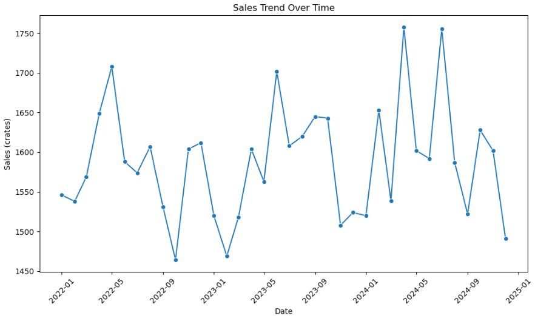
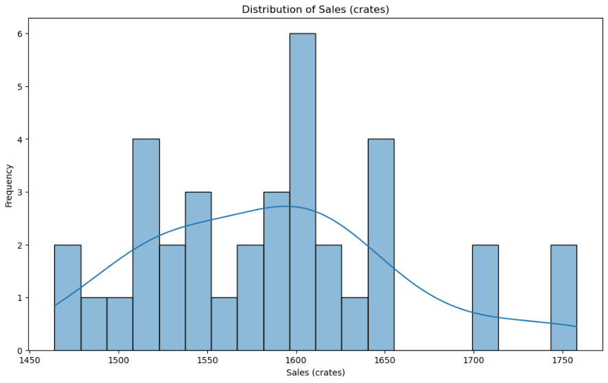
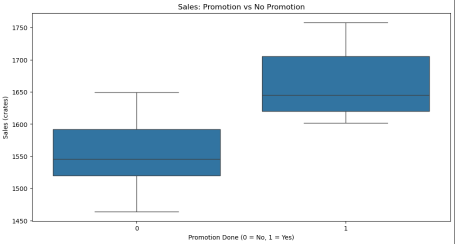
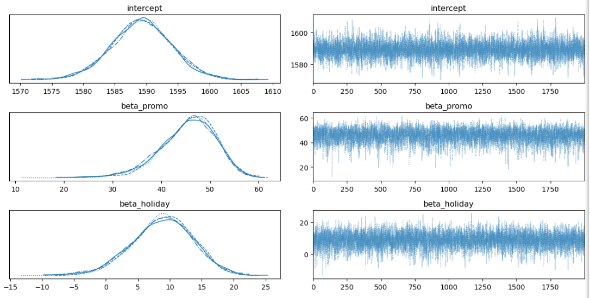
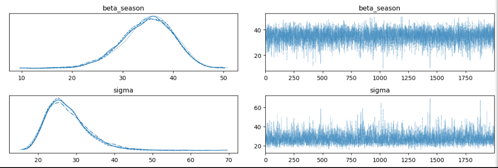

## Bayesian Regression Analysis for Forecasting Coca-Cola Outlet Sales in Dekina, Nigeria

## Project Overview

Accurate sales forecasting is a critical challenge for companies in the fast-moving consumer goods (FMCG) sector. For Coca-Cola outlets in Dekina, Kogi State, Nigeria, demand fluctuates due to seasonality, promotional activities, and holidays, making traditional forecasting methods unreliable. Poor forecasting often results in inventory shortages, wastage, and missed revenue opportunities.

This project applies Bayesian regression analysis to develop a robust, data-driven model for forecasting Coca-Cola sales. Unlike frequentist regression methods, the Bayesian approach integrates prior knowledge, handles uncertainty, and produces probabilistic forecasts—providing not only expected values but also credible intervals that quantify uncertainty.

## Data Sources

The dataset consists of **36 months of sales records** from Coca-Cola outlets in Dekina, Kogi State, Nigeria. It includes the number of crates sold per month along with indicators for **promotions**, **holidays**, and **seasonal cycles** (rainy/dry season). Additional context on holidays and seasonality was obtained from local calendars.

## Tools

- Excel - Data Collection [Download here](https://microsoft.com)
- Python – Main programming language for data analysis and model building [Download here](https://www.python.org/downloads/)
- Pandas – Data cleaning, manipulation, and preparation of the sales dataset
- NumPy – Numerical computations and array handling
- Matplotlib & Seaborn – Visualization of sales trends, seasonality, and model outputs
- PyMC – Implementation of the Bayesian regression model and probabilistic forecasting
- ArviZ – Diagnostic checks, posterior analysis, and visualization of Bayesian model results
- Scikit-learn – Standardization and preprocessing of input features

## Data Cleaning/Preprocessing 

***Steps Performed:***
1. Load Dataset: Import the sales data from Excel and inspect for consistency.
2. Convert Date Column: Transform the date column into datetime format.
3. Extract Month: Derive the month from the date to capture temporal trends.
4. Encode Cyclical Features: Use sine and cosine transformations to encode month cyclicality.
5. Create Seasonal Indicator: Generate a binary variable to mark peak sales months (April–August).
6. Select Features: Identify predictors relevant for modeling: promotion_done, holidays, season, sin_month, cos_month.
7. Split Data: Separate data into training and test sets, reserving the last 3 months for testing.
8. Scale Predictors: Standardize features for numerical stability in modeling.

### Implementation in Python

The following Python code snipet demonstrates the data cleaning and preprocessing steps stated above:

```python
# importing all the necessary libraries for data preprocessing, analysis and visualization
import pymc as pm                         #for Probabilistic programming for Bayesian modeling
import pandas as pd                      # for Data manipulation and analysis
import numpy as np                       # for Numerical operations and array handling
import matplotlib.pyplot as plt          # for Visualization and plotting
import arviz as az                       # for Diagnostics and visualization of Bayesian inference
from sklearn.preprocessing import StandardScaler  # Feature standardization
from sklearn.metrics import mean_absolute_error, mean_squared_error, r2_score  # Model evaluation metrics
import seaborn as sns
# Load dataset
df = pd.read_excel("Sales_data.xlsx", sheet_name="OutletA")
```
***Find the complete [data cleaning and preprocessing code here](/scripts/data_cleaning_and_preprocessing.ipynb)***

## Data Analysis
### Exploratory Data Analysis (EDA)
***Objective:*** Get to know the data, and check how promotions/holidays relate to sales 

#### Key Steps Performed:
- Inspect summary statistics and first rows.
- Visualize overall sales distribution (histogram / KDE).
- Plot sales over time to reveal trends and seasonality.
- Compare sales for promotion vs no-promotion and holiday vs non-holiday (boxplots).
- Examine monthly average sales and a correlation matrix to identify relationships.
  ```python
  #Quick look
  display(df.head())
  print(df[["sales_in_crates", "promotion_done", "holidays", "season"]].describe())
  ```
  #### Key Insights From Visuals:
  ### Sales Trend Over Time
  
  ### Sales Distribution
  
  ### Promotion VS No-Promotion Sales
  

     
  ***Find the complete [exploratory data analysis code here](/scripts/EDA.ipynb)***

## Modeling
**Bayesian linear regression** model was used to quantify the impact of promotions, holidays, and seasonality on sales. While the EDA provided visual evidence of these relationships, the model allowed to:
- Estimate the magnitude of each factor’s effect on sales
- Capture uncertainty in these estimates through posterior distributions
- Generate probabilistic forecasts, not just point predictions

### Traceplots
<p align="center">  </p>
<p align="center">  </p>

### Key Insights from the Model:
- Baseline sales: The outlet typically sells around 1,590 crates per month.
- Promotions: Running a promotion increases sales by about 45 crates per month.
- Holidays: Holidays have only a small and uncertain effect on sales.
- Seasonality: During the rainy season (April–August), sales increase by about 35 crates per month.

  #### Model Accuracy:
- The model predicted sales quite well, with low error (MAE ≈ 20.12 crates, RMSE ≈ 24.72 crates) and a strong fit (R² ≈ 0.83).

  ***Find the complete [MODELING code here](/scripts/Modeling_script.ipynb)***

## Forecasting

I extended the Bayesian regression model to generate a 12-month sales forecast. The model incorporates promotions, holidays, and seasonality, and produces both a median forecast and uncertainty intervals (90% CI) to reflect prediction confidence.

[Sales Forecast Plot](/Images/Forecast_plot.png)

### Key Insights from the Forecast Plot:

📉**February dip:** Sales are expected to drop slightly in February (~1550 crates).

📈**Steady recovery:** From March to July, sales stabilize around ~1630 crates.

🚀**Peak in August:** A sharp rise is predicted, reaching ~1700+ crates, driven by seasonality and promotions.

⚖️**Stable outlook:** From September onward, sales level off around ~1630–1650 crates with relatively narrow uncertainty bands.

This forecast provides a forward-looking guide for inventory planning and promotional strategy.

***Find the complete [Forecasting code here](/scripts/Forecast_script.ipynb)***
